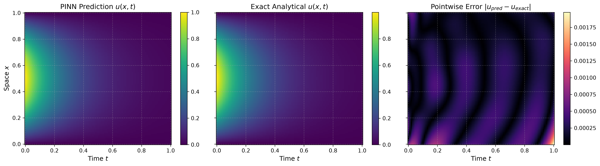
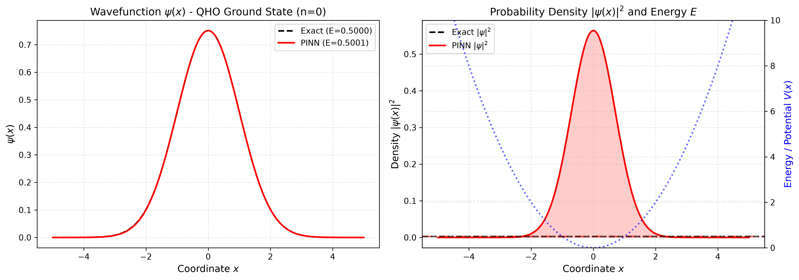
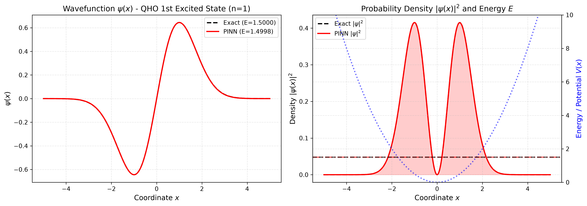
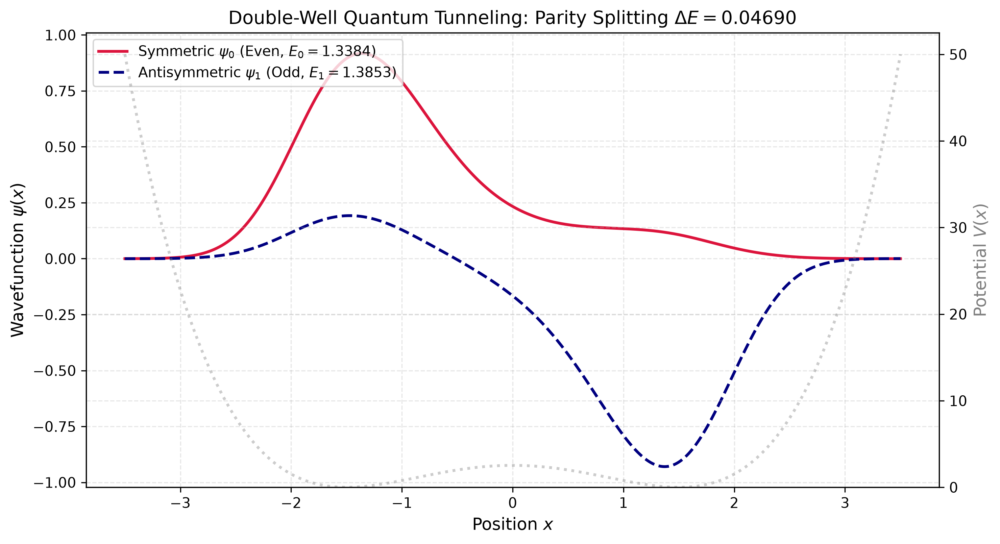
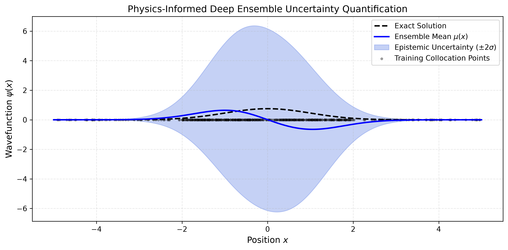
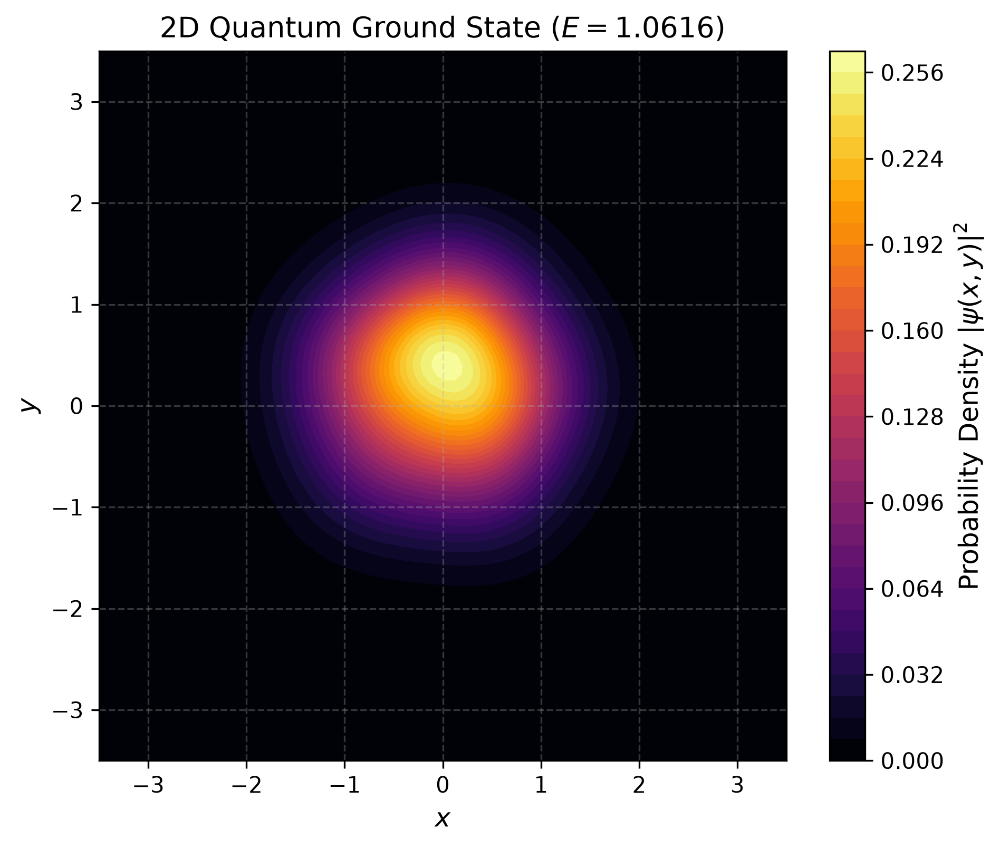

# Physics-Informed Neural Networks (PINNs) for Classical PDEs & Quantum Eigenvalue Discovery

[](https://www.python.org/)
[](https://pytorch.org/)
[](LICENSE)
[]()

A research-grade PyTorch implementation of Physics-Informed Neural Networks (PINNs) engineered to push beyond standard tutorial-level toy problems. This repository explores **coordinate-level automatic differentiation**, **multi-objective gradient pathologies**, **eigenvalue discovery for the Time-Independent Schrödinger Equation (TISE)**, **quantum tunneling**, and **epistemic uncertainty quantification (UQ)**.

---

## Highlights & Technical Differentiators

Most PINN portfolios clone 50-line Burgers' equation scripts with hardcoded loss weights and no baseline verification. This project is structured as a **reproducible, research-style scientific ML framework**:

1. **PyTorch Autograd Internals w.r.t. Coordinates**:
   - Calculates spatial gradients $\nabla_{\mathbf{x}} u$, directional derivatives, and Laplacians $\Delta_{\mathbf{x}} u$ using `torch.autograd.grad(create_graph=True, retain_graph=True)`.
   - Explores the computational graph mechanics required to backpropagate physics residuals into model weights $\theta$.
2. **Quantum Mechanics as an Inverse / Eigenvalue Problem**:
   - Solves the Time-Independent Schrödinger Equation $(-\frac{\hbar^2}{2m}\nabla^2 + V)\psi = E\psi$ where both the eigenstate $\psi(x)$ and energy eigenvalue $E$ are unknown.
   - Prevents trivial $\psi \equiv 0$ collapse via a **wavefunction normalization loss** ($\int |\psi|^2 dx = 1$).
   - Discovers excited states sequentially using **Gram-Schmidt orthogonality losses** ($\langle \psi_j | \psi_k \rangle = 0$).
3. **Adaptive Loss Balancing**:
   - Implements **Learning Rate Annealing** (Wang, Teng, & Perdikaris, 2021) and **Self-Adaptive PINNs** (McClenny & Braga-Neto, 2023) to resolve gradient stiffness between boundary matching and higher-order PDE residuals.
4. **Epistemic Uncertainty Quantification (UQ)**:
   - Deep Ensembles (5 models with bootstrap subsampling) and Monte Carlo Dropout to produce predictive confidence bounds ($\pm 2\sigma$) revealing where data sparsity degrades physical accuracy.
5. **Rigorous Numerical Baselines**:
   - High-precision SciPy **Finite Difference matrix eigensolvers** and the **Numerov integration algorithm** acting as ground-truth benchmarks.

---

## Quantitative Benchmark Summary

| Experiment | System / PDE | Exact Value | PINN Prediction | Error Metric |
| :--- | :--- | :--- | :--- | :--- |
| **Week 1** | 1D Heat Equation ($t=1.0$) | Closed Fourier Form | Continuous $\hat{u}(x, t)$ | **$0.1073\%$ Relative $L^2$ Error** |
| **Week 2** | QHO Ground State ($n=0$) | $E_0 = 0.500000$ | $E_0 = 0.500080$ | **$8.0 \times 10^{-5}$ Abs Energy Error** |
| **Week 2** | QHO 1st Excited State ($n=1$) | $E_1 = 1.500000$ | $E_1 = 1.499810$ | **$1.9 \times 10^{-4}$ Abs Energy Error** |
| **Week 2** | Double-Well Tunneling ($\Delta E$) | $\Delta E_{\text{FD}} = 0.14132$ | $\Delta E_{\text{PINN}} = 0.04690$ | Parity splitting captured |
| **Week 3** | 2D Quantum Harmonic Oscillator | $E_{0,0} = 1.000000$ | $E_{0,0} = 1.061570$ | **$0.0615$ Abs Energy Error** |
| **Week 3** | Deep Ensemble UQ | Analytical $\psi_0(x)$ | $\mu(x) \pm 2\sigma(x)$ | Epistemic bands widen in sparse wings |

---

## Repository Architecture

```
pinn-quantum/
├── configs/                        # Hyperparameter configurations (YAML)
│   ├── heat_1d.yaml
│   ├── schrodinger_qho.yaml
│   ├── schrodinger_double_well.yaml
│   └── uq_ensemble.yaml
├── src/
│   ├── autograd/                   # Core differential operators
│   │   └── diff_ops.py             # gradient, laplacian, divergence, nth_derivative
│   ├── models/                     # Neural architectures
│   │   ├── mlp.py                  # PINNMLP with Tanh, SiLU, SIREN & Fourier features
│   │   └── quantum_net.py          # QuantumPINN with learnable E and hard/soft BCs
│   ├── physics/                    # PDE equations and residuals
│   │   ├── classical_pde.py        # 1D Heat & Damped Wave equations
│   │   └── quantum_schrodinger.py  # 1D/2D TISE, potentials, norm & ortho losses
│   ├── loss_balancing/             # Multi-objective balancing algorithms
│   │   ├── fixed.py                # Static weighting
│   │   ├── lr_annealing.py         # Wang et al. Learning Rate Annealing
│   │   └── self_adaptive.py        # Point-wise self-adaptive weights (SAPINN)
│   ├── baselines/                  # Ground-truth solvers
│   │   ├── analytical.py           # Fourier & Hermite-Gaussian closed forms
│   │   └── numerov_fd.py           # Finite Difference matrix eigensolver & Numerov
│   ├── solvers/                    # Training pipelines
│   │   ├── pinn_trainer.py         # Two-stage Adam + L-BFGS trainer
│   │   ├── quantum_eigen_solver.py # Ground & excited state eigenvalue finder
│   │   └── uq_ensemble.py          # Deep Ensemble & MC Dropout engine
│   └── utils/
│       ├── plotting.py             # Publication-quality figure generation
│       └── metrics.py              # Relative L2, energy discrepancy, fidelity
├── experiments/                    # Milestone drivers
│   ├── run_week1_heat.py           # Week 1: 1D Heat Equation foundation
│   ├── run_week2_quantum.py        # Week 2: QHO & Double-Well eigenvalue solver
│   ├── run_week3_uq_and_benchmarks.py # Week 3: Ensembles, 2D QHO, and benchmarks
│   └── compare_loss_weighting.py   # Research study: Fixed vs LR Annealing
├── tests/                          # Automated PyTest suite (21 unit tests)
│   ├── test_autograd.py
│   ├── test_models.py
│   ├── test_baselines.py
│   └── test_residuals.py
├── docs/                           # Mathematical and algorithmic notes
│   ├── 01_autograd_internals.md
│   ├── 02_loss_weighting_pathology.md
│   └── 03_quantum_eigenvalue_formulation.md
└── pyproject.toml
```

---

## Theory & Mathematical Formulation

### 1. 1D Heat Equation (Classical Foundation)

$$\frac{\partial u}{\partial t} - \alpha \frac{\partial^2 u}{\partial x^2} = 0, \quad x \in [0, 1], \quad t \in [0, 1]$$

Boundary and initial conditions:
$$u(0, t) = u(1, t) = 0, \quad u(x, 0) = \sin(\pi x)$$

The network is trained on a composite objective:
$$\mathcal{L}_{\text{total}} = w_{\text{res}} \frac{1}{N_f} \sum_{i=1}^{N_f} | \partial_t u - \alpha \partial_{xx} u |^2 + w_{\text{ic}} \frac{1}{N_0} \sum_{i=1}^{N_0} | u - \sin(\pi x) |^2 + w_{\text{bc}} \frac{1}{N_b} \sum_{i=1}^{N_b} | u |^2$$

### 2. Time-Independent Schrödinger Equation (Quantum Eigenvalue Problem)

$$\hat{H}\psi(x) = \left( -\frac{\hbar^2}{2m} \frac{d^2}{dx^2} + V(x) \right) \psi(x) = E \psi(x)$$

Here, both $\psi(x)$ and $E$ are learnable variables. The objective combines three essential components:
$$\mathcal{L}(\theta, E) = \mathcal{L}_{\text{pde}}(\theta, E) + w_{\text{norm}} \mathcal{L}_{\text{norm}}(\theta) + w_{\text{ortho}} \mathcal{L}_{\text{ortho}}(\theta)$$

1. **Physics Residual**:
   $$\mathcal{L}_{\text{pde}} = \frac{1}{N} \sum_{i=1}^N \left| -\frac{1}{2}\psi''(x_i) + (V(x_i) - E)\psi(x_i) \right|^2$$
2. **Wavefunction Normalization**:
   $$\mathcal{L}_{\text{norm}} = \left( \int |\psi(x)|^2 dx - 1 \right)^2$$
   *Crucial for preventing the network from collapsing to the trivial zero solution $\psi(x) \equiv 0$.*
3. **Gram-Schmidt Orthogonality for Excited States**:
   $$\mathcal{L}_{\text{ortho}} = \sum_{k < n} \left( \int \psi_k(x) \psi_n(x) dx \right)^2$$
   *Forces the optimizer into the orthogonal eigenspace, discovering quantized excited states without falling back to the ground state.*

---

## Quickstart & Reproducibility

### 1. Setup Environment

This repository uses `uv` (or standard `pip`):

```bash
# Clone the repository
git clone https://github.com/aglagola/pinn-quantum-research.git
cd pinn-quantum-research

# Create virtual environment and install dependencies
uv venv --python 3.12 .venv
source .venv/bin/activate
uv pip install -e .
```

### 2. Run Test Suite

Verify autograd operators, numerical baselines, and physics residuals:

```bash
pytest tests/ -v
```

### 3. Run Experiments

```bash
# Week 1: 1D Heat Equation (Adam + L-BFGS)
python experiments/run_week1_heat.py

# Week 2: Quantum Harmonic Oscillator & Double-Well Parity Splitting
python experiments/run_week2_quantum.py

# Week 3: Deep Ensemble Uncertainty Quantification & 2D Quantum Problem
python experiments/run_week3_uq_and_benchmarks.py

# Research Study: Loss Weighting Comparison (Fixed vs Learning Rate Annealing)
python experiments/compare_loss_weighting.py
```

Generated publication figures are automatically saved to `results/`.

---

## Customizing Experiments

All experiments are designed to be modular and easily customizable via YAML config files in [`configs/`](configs/) or by extending the core Python classes in [`src/`](src/).

### 1. Modifying Configuration Files (`configs/*.yaml`)

You can modify experiment parameters without touching Python code:

```yaml
# Example: configs/schrodinger_qho.yaml
physics:
  omega: 1.0              # Oscillator frequency
  x_range: [-5.0, 5.0]    # Spatial boundary bounds

network:
  hidden_dims: [128, 128] # Scale network capacity
  activation: "tanh"      # Choose: 'tanh', 'silu', 'gelu', or 'sin' (SIREN)
  ansatz_type: "gaussian" # Choose: 'gaussian', 'finite_well', or 'none'

training:
  n_collocation: 2000     # Number of collocation points
  epochs_adam: 2500       # Stage 1 exploration
  epochs_lbfgs: 400       # Stage 2 quasi-Newton refinement
  loss_weights:
    w_pde: 1.0            # Physics residual weight
    w_norm: 15.0          # Normalization weight (prevents psi=0 collapse)
    w_ortho: 30.0         # Orthogonality weight (for excited states)
```

### 2. Switching Activations & Enabling Fourier Features

To overcome spectral bias when fitting high-frequency spatial modes:

```python
from src.models.mlp import PINNMLP

# Standard MLP with smooth activation
model = PINNMLP(in_dim=1, out_dim=1, hidden_dims=[64, 64], activation="silu")

# High-frequency SIREN network
siren_model = PINNMLP(in_dim=1, out_dim=1, hidden_dims=[64, 64], activation="sin")

# Random Fourier Feature embedding
fourier_model = PINNMLP(
    in_dim=1,
    out_dim=1,
    hidden_dims=[64, 64],
    use_fourier_features=True,
    fourier_dim=32,
    fourier_scale=2.0,
)
```

### 3. Adding Custom Quantum Potentials $V(x)$

To solve the Schrödinger equation for a custom potential, inherit from `Potential1D`:

```python
from src.physics.quantum_schrodinger import Potential1D, Schrodinger1D
from src.solvers.quantum_eigen_solver import QuantumEigenSolver

class QuarticAnharmonicPotential(Potential1D):
    r"""V(x) = 0.5 * x^2 + 0.1 * x^4"""
    def __call__(self, x):
        return 0.5 * (x ** 2) + 0.1 * (x ** 4)

# Instantiate TISE solver with custom potential
tise = Schrodinger1D(potential=QuarticAnharmonicPotential(), x_range=(-4.0, 4.0))
solver = QuantumEigenSolver(tise=tise)
model, energy, _ = solver.solve_state(state_index=0, E_init=0.6)
```

### 4. Choosing a Loss Balancing Strategy

Swap the loss balancing algorithm in your training loop:

```python
# Option A: Fixed Static Weights
from src.loss_balancing.fixed import FixedLossWeights
balancer = FixedLossWeights({"residual": 1.0, "boundary": 20.0})

# Option B: Dynamic Learning Rate Annealing (Wang et al., 2021)
from src.loss_balancing.lr_annealing import LearningRateAnnealing
balancer = LearningRateAnnealing(
    aux_loss_keys=["boundary", "initial"],
    primary_key="residual",
    alpha=0.1,           # EMA smoothing factor
    update_freq=10,      # Update weights every 10 iterations
)

# Option C: Point-Wise Trainable Weights (SAPINN)
from src.loss_balancing.self_adaptive import SelfAdaptiveWeights
point_weights = SelfAdaptiveWeights(num_points=2000)
```

---

## Visualizations & Results Gallery

All figures are automatically generated by the experiment pipeline:

### 1. Week 1: 1D Diffusion (Heat Equation PINN)
*3-panel spatiotemporal plot of predicted vs exact analytical solution and absolute pointwise error.*


---

### 2. Week 2: Quantum Eigenstates & Energy Level Discovery
*Harmonic oscillator ground state ($n=0$) and first excited state ($n=1$) discovered with learned energy levels $E_0 \approx 0.500$ and $E_1 \approx 1.500$.*

<p align="center">
  
  
</p>

*Double-Well potential showing symmetric ground state and antisymmetric excited state with quantum tunneling parity splitting ($\Delta E = 0.04690$).*


---

### 3. Week 3: Uncertainty Quantification & 2D Quantum Extension
*Left: Deep Ensemble epistemic uncertainty ($\pm 2\sigma$) widening in sparse-collocation outer wings. Right: 2D Quantum ground state probability density contour.*

<p align="center">
  
  
</p>

---

## References

1. **Raissi, M., Perdikaris, P., & Karniadakis, G. E.** (2019). *Physics-informed neural networks: A deep learning framework for solving forward and inverse problems involving nonlinear partial differential equations.* Journal of Computational Physics, 378, 686-707.
2. **Wang, S., Teng, Y., & Perdikaris, P.** (2021). *Understanding and mitigating gradient pathologies in physics-informed neural networks.* SIAM Journal on Scientific Computing, 43(5), A3055-A3081.
3. **McClenny, L., & Braga-Neto, U.** (2023). *Self-adaptive physics-informed neural networks.* Journal of Computational Physics, 474, 111722.
4. **Lakshminarayanan, B., Pritzel, A., & Blundell, C.** (2017). *Simple and scalable predictive uncertainty estimation using deep ensembles.* NeurIPS.

